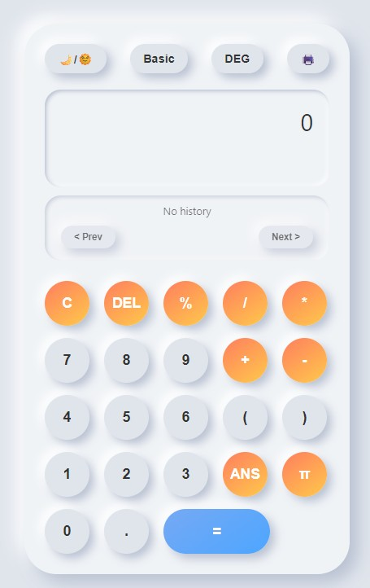
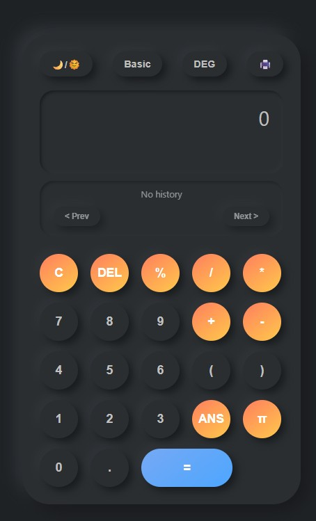
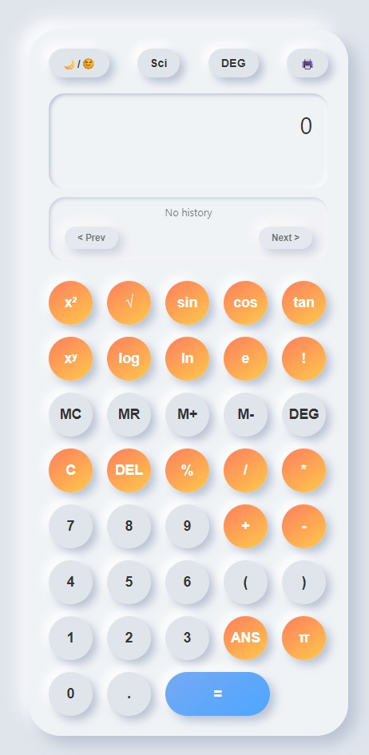
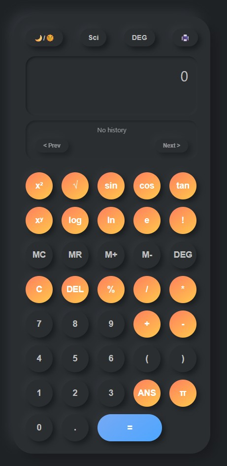

# 🧮 3D Calculator

🔗 **Live Demo:** [Try it here](https://tonirul.github.io/3dCalculator/)


A modern, interactive **3D Calculator** supporting both **Normal** and **Scientific** modes, with **Light/Dark themes** and a smooth 3D UI design.  
This project is built for learning, experimenting with UI/UX, and showcasing advanced calculator features in a web app.

---

## 📑 Table of Contents
- [Features](#-features)
- [Screenshots](#-screenshots)
- [Tech Stack](#-tech-stack)
- [Getting Started](#-getting-started)
- [Project Structure](#-project-structure)
- [Usage](#-usage)
- [Contributing](#-contributing)
- [License](#-license)

---

## ✨ Features
- ✅ **Basic Arithmetic** → Addition, subtraction, multiplication, division  
- ✅ **Scientific Functions** → sin, cos, tan, log, power, factorial, etc.  
- ✅ **3D UI Design** → Buttons and layout styled for a 3D effect  
- ✅ **Dark & Light Mode** → Toggle between themes for better visibility  
- ✅ **Responsive Layout** → Works across desktop and mobile screens  
- ✅ **Keyboard Support** → Input using mouse or keyboard  

---

## 📸 Screenshots

### 🔹 Normal Mode
| Light Theme | Dark Theme |
|-------------|------------|
|  |  |

### 🔹 Scientific Mode
| Light Theme | Dark Theme |
|-------------|------------|
|  |  |

---

## 🛠 Tech Stack
- **HTML5** – structure of the calculator  
- **CSS3** – styling, animations, 3D effects, themes  
- **JavaScript (ES6+)** – calculator logic & interactivity  
- **VS Code** – development environment  
- *(Optional)*: GitHub Pages for hosting  

---

## 🚀 Getting Started

### 1️⃣ Clone the repository
```bash
git clone https://github.com/tonirul/3dCalculator.git
cd 3dCalculator
2️⃣ Open the project
You can open directly in VS Code:

bash
 
code .
3️⃣ Run the project
Option 1: Right-click index.html → Open with Browser

Option 2: Use the VS Code extension Live Server

Option 3: Host it using GitHub Pages (free deployment)

📂 Project Structure
bash
 
3dCalculator/
│── assets/                 
│   ├── light-normal.jpg
│   ├── dark-normal.jpg
│   ├── light-scientific.jpg
│   ├── dark-scientific.jpg
│
│── index.html              # Main calculator UI
│── style.css               # Styles, themes, 3D effects
│── script.js               # Calculator logic
│── README.md               # Documentation
🖥 Usage
Select Normal mode for basic calculations.

Switch to Scientific mode for advanced operations.

Toggle Light/Dark mode using the theme switcher.

Use either your keyboard or mouse to enter values.

🤝 Contributing
Contributions, issues, and feature requests are welcome!

Fork the repo

Create a new branch (feature-new-mode)

Commit your changes (git commit -m "Add new mode")

Push the branch (git push origin feature-new-mode)

Open a Pull Request

📝 License
This project is licensed under the MIT License.
You are free to use, modify, and distribute this project with attribution.

⭐ If you like this project, don’t forget to give it a star on GitHub!
